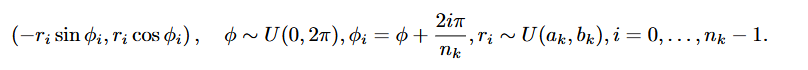
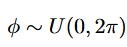
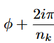
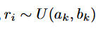
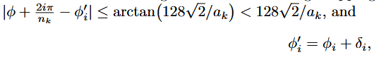
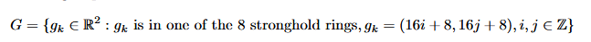
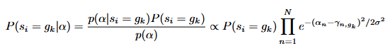
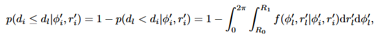
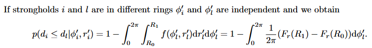

# StupidBrain

A Minecraft stronghold calculator which utilises a bayesian statistics method of calculating the position of the stronghold. This approach implements the methods layed out in [this document](RMassets/triangulation.pdf) made by the very smart and cool NingaBrain. This entire bot is my attempt at recreating [his bot](https://github.com/Ninjabrain1/Ninjabrain-Bot) myself out of curiosity

---
## How does this work

If you want a good explanation without going over the exact math behind this calculator I highly reccomend checking out [this video](https://www.youtube.com/watch?v=jZ8fh-LJB88) by Heppe as well as [this video](https://www.youtube.com/watch?v=rglAku0nrKM&t=355s) by DIMM4; both of which significantly helped me as well in understand what the idea and logic behind the bot was.

If you want the actual math broken down from the document, I will attempt to explain it below. This explanation **assumes** you have watched the other videos I have listed above as those give a really good explanation on a level well enough for most people. It also assumes you know enough about minecraft to understand some terms. This is intended to be a walkthrough of the math done rather than an explanation on how the method works on a high level.  

The paper starts off by algebraically defining the locations of a stronghold within a ring (let's call this ring k).  

We are first randomly generating and angle between 0 and 2π (aka 0 and 360 degrees but for ease we will be using radians for the rest of the explanation).  

Then we are equally distributing this across the entire ring lets say the ring had 3 strongholds n_k would be 3 and the variable "i" would increment from 0 to 2. This results in the strongholds being equal angles apart  

This randomly decides how far away from (0, 0) the strongholds should be placed using a uniform distribution (all numbers have equal chance). a_k and b_k are the start and end displacements of the ring reigons.  

Afterwards, the stronghold does 2 different snaps. One to the 8,8 coordinate of the chunk. Another, will be a biome snap where it tries to search for a valid place to place the stronghold anywhere between 0 and 128√2 blocks in any direction.  

Now we know how the strongholds are placed, I want to jump a bit ahead to how the measurement error is accounted for becuase it makes a lot more sense chronologically. The measurement error essentially deciding how accurate is your measurement and how much should it be trusted.
This step is necessary becuase of 2 reasons. 

1. Humans are not accurate. I personally don't know about you, but I severely doubt you are able to consistently be accurate with your mouse to a subpixel level. 
2. Minecraft itself is not that accurate (at least in the info it gives.) This is due to it only giving us an accuracy up to 2 decimal places which is frankly nowhere near enough to be able to accurately decide the stronghold location without this. 

That's why we add in some extra math to account for the errors we get with both Minecraft and human imprecision.

This first line here basically means we are going to create a massive set with every possible coordinate the eye could be pointing to. This is possible because there are a pretty finite amount of places where one can spawn. Only (8, 8) coordinates in a chunk which is in one of the ring reigons. 
  

When we read the player's measurement of the eye of ender angle we assume it is [normally distributed](https://en.wikipedia.org/wiki/Normal_distribution) with the standard deviation being a value they themselves select. The standard deviation should be how much the player's measurements vary by when they measure the eye. The mean for the distribution is 0 (a perfect measurement). This is because a player's measurements should vary equal amounts to the left and right. The normal distriubtion is calculated as a [PDF](https://en.wikipedia.org/wiki/Probability_density_function) We add this to the theoretically perfect angle between you and the stronghold. This math is then repeated for every throw as well as for each chunk in the set G. Then we apply [Bayes' Theroem](https://en.wikipedia.org/wiki/Bayes%27_theorem) to update our probabilites as more eyes are thrown.   

Now we can go back to finding the closest stronghold. This is mostly where all the scary parts come into play. I won't go into exact detail with this as I am yet to fully understand it myself but the general idea here is we are each comparing each candidate chunk (i in this case) to each other one (l) and trying to find what are the chances there is a closer stronghold. R1 and R0 are the bounds where if a l spawns inside it is closer to you than i.   
  

This is some math saying what is the chance of the zone we calculated earlier intersecting with a ring reigon which is not the same one as the out current one.  

"But sTuUnNNtTt what if they are in the same ring????" 

Umm, we take them out back and pretend they never existed cause that is too complicated with literally no payoff. Fun fact. These last 2 paragraphs with the complicated integrals are actually not necessary to get a good enough prediction. They only really come into play when you try them out at blind distance coords but even then not entirely neccessay if you want a good enough prediction. This part is really compuationally expensive so we take a few shortcuts here to speed things up.

    