# StupidBrain

A Minecraft stronghold calculator which utilises a Bayesian statistics method of calculating the position of the stronghold. This approach implements the methods laid out in [this document](RMassets/triangulation.pdf) made by the very smart and cool NingaBrain. This entire bot is my attempt at recreating [his bot](https://github.com/Ninjabrain1/Ninjabrain-Bot) myself out of curiosity.

I also added a FSG filter for 1.16.1 because I thought it would be a fun thing to have in the project. It can filter for the 5 main seed types (Village, Shipwreck, Desert Temple, Buried Treasure and Ruined Portal)

## Table of Contents

[Prerequisites](#Prerequisites)  
[Download Instructions](#DownloadInstructions)  
[Features](#Features)  

### Stronghold Calculator
1. [Usage Guide](#CalcUsageGuide)
   1. [Setting the Standard Deviation](#SettingStrdDev)
      1. [If you don't know the value](#ValueUnknown)
      2. [If you know the value](#ValueKnown)
   2. [How to use the calculator](#CalcUse)
   3. [Extra Tips](#CalcExtraTips)
2. [How it works](#BotExplanation)
   1. [An Overview of the Logic](#LogicOverview)
      1. [The Stupid Method](#StupidMethod)
      2. [The Mediocre Method](#MediocreMethod)
      3. [The Pro Method](#ProMethod)
   2. [The Math Behind It](#FancyMath)

### Seed Finder
1. [Usage Guide](#SeedUsageGuide)
2. [Important Notes and Tips](#SeedExtraTips)
3. [Seed Filter Conditions](#SeedFilterCons)
   1. [Village](#Village)
   2. [Desert Temple](#DesertTemple)
   3. [Buried Treasure](#BuriedTreasure)
   4. [Shipwreck](#Shipwreck)
   5. [Ruined Portal](#RuinedPortal)
   6. [Bastion](#Bastion)

---

## Prerequisites 

Note that to use this program, you will need the following: 

 - Windows 11 device
 - Minecraft Java Edition 1.16.1
 - The program itself
 - OBS is sometimes helpful but not needed

### How to Download 
To download, click on the GitHub Release and download the main.zip.  
Then you need to extract the zip, open the folder, and run main.exe.

If you want to build from source, do the following:

    git clone https://github.com/Stu67nt/StupidBrain
    cd StupidBrain
    pip install -r requirements.txt
    python main.py
   
---

## Features 
 - Calculate the position of the nearest stronghold with one eye measurement
 - Allows for many measurements for even better accuracy
 - Measurement locking so you can stay on track to the stronghold
 - 1.16.1 seed filter so you can find good speedrunning seeds. 

---

## Stronghold Calculator

## Usage Guide 

I have prepared a video, shown below, to showcase how to use this calculator properly in order to set it up so you can begin measuring eyes. 

### Setting the Standard Deviation 

You will first need to configure a standard deviation. This will be how accurate your measurements are to the actual angle the eye is pointing. This is a value you will give in degrees. 

1. To configure this, click on "Config Window".  
At this point, if you know your Standard Deviation value (such as from Ningabrain Bot), skip the section 2 instructions and follow the section 3 ones. If you do not know this value, follow the section 3 instructions.   

#### If you don't know the value 

2.1) Load up a new creative regular terrain world in Minecraft, give yourself an Eye of Ender and fly up to the sky so you don't deal with obstructions. Then run the following command:  

    /locate stronghold 

2.2) Click on the green highlighted coordinates then copy them into the text box and click "Submit".  
2.3) Measure the eye by looking at it as accurately as you would normally in a speedrun and press F3 and C at the same time.  

To measure the eye, I recommend you lower FOV to 30 and your sensitivity to 0/\*yawn* once your crosshair is on the eye for better measurement. As you can see below, you want the right edge of your crosshair to align with the left side of the centre pixel of the eye. This is the optimal measurement. If you are unable to get this accurate, it is OK, but better accuracy will lead to much more accurate measurements. 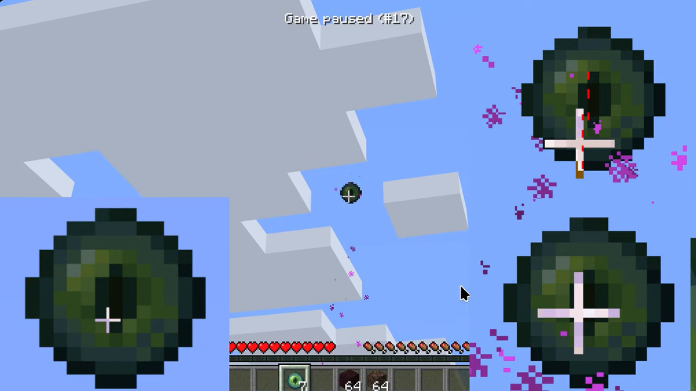

2.4) Once this is done, open the chat and press CRTL and V, then press Enter. This should teleport you roughly 200 blocks away from the stronghold. Repeat steps 4 and 5 until the standard deviation value has settled. Then click "Submit" and close the window. The value has now been setup and you can jump ahead to the next heading part.

#### If you know the value 

3.1) The program will ask for some TP coordinates. You should be able to just enter the following instead and click "Submit".  

    /tp @s 0 ~ 0

3.2) Enter your 1.13+ standard deviation value and click "Submit". and close the window. The value has now been setup and you can jump ahead to the next heading part.

### How to use the calculator 

1. Throw an eye of ender, which will point in the direction of the stronghold.
2. Look and measure the direction of the angle as described earlier. 
3. Once you have got a good angle alignment, press F3 and C to copy your player position.
4. Check the calculator to see the top 5 results. Each result will have a confidence level describing how likely it is to be the correct position. This will be under the % tab.
5. If the number is not decently confident (like 60+%), then you can move some distance away (like 100 or so blocks, but it depends on your coordinates) and repeat the steps above.
6. Once you have a measurement you are confident in you can lock the measurement with the lock button. Now when you F3+C, it will instead tell you the updated distance and angle of travel between you and each predicted stronghold location. You can press "Unlock" (the lock button text will change to unlock) to measure as normal. 
7. If you want to find the location of a different stronghold, click reset to clear the previous data and use as normal.

### Extra tips 

 - If you see that you have a lot of top candidates with very close coordinates but low-mid certainty (like 15% ish), then it is likely safe to send the location of the top candidate, as it is likely due to very slight measurement error. 
 - Pressing F3+ESC allows you to pause the game without opening the pause menu. You can use this to pause and buffer your mouse movements for more precise measurements.
 - Right-Clicking inside the window of the calculator allows you to toggle the window staying on top at all times.~~
 - On OBS, you can create a new source for your Minecraft window, which you can then use to create a scene which shows a more zoomed-in version of your crosshair to be able to better line up the eye. I will not explain how to set this up, but you could probably figure it out yourself or find a YouTube video on it. 

---
## How does this work 

If you want a good explanation without going over the exact math behind this calculator, I highly recommend checking out [this video](https://www.youtube.com/watch?v=jZ8fh-LJB88) by Heppe as well as [this video](https://www.youtube.com/watch?v=rglAku0nrKM&t=355s) by DIMM4; both of which significantly helped me as well in understanding what the idea and logic behind the bot was.

### An Overview of the Logic 

If you are too lazy to watch those videos and just want me to explain it, read this section.  

#### The Stupid Method 
In Minecraft, you have an Eye of Ender. What this item does is point to the closest stronghold in the world from your current position. If you are playing casually, you would look at the direction the eye is going and then walk in that direction until you feel you went far enough, then throw another eye. This method is horrible and inefficient. It gives you no sense of distance you need to travel, and you can easily overshoot the stronghold (The circles are the Eye of  Enders).  
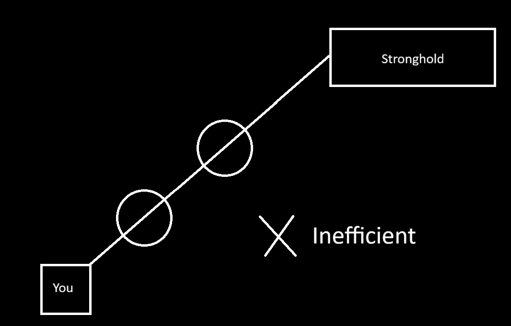
So let's improve this.  

#### The Mediocre Method 
Now what if instead we upgraded to throwing 2 eyes. What we could do is measure the angle the eye is pointing at 2 different positions and note down the angle the eye was pointing in as well as the X and Z coordinates of each place we measured. This would allow us to form 2 lines and intersect them. We can then apply basic trigonometry to be able to tell where the lines are intersecting.

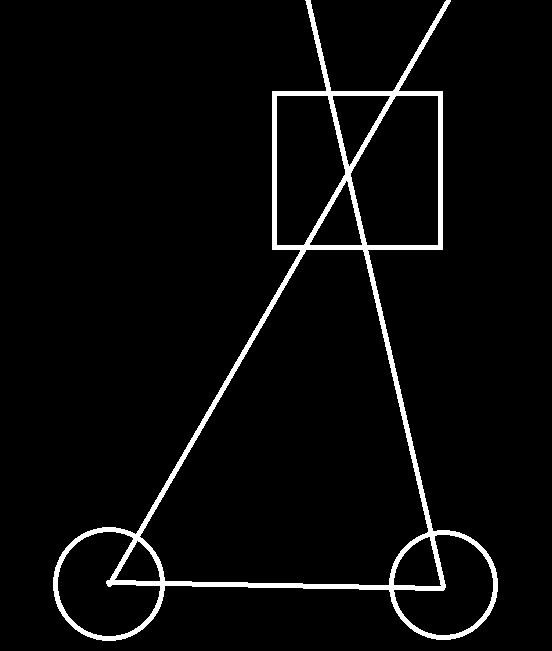

This should be where the stronghold is, right? Theoretically, yes. But in reality, this is not the case. Often, when you try this, you are still 100s of blocks away from the stronghold, which is minutes of time loss in a speedrun. Now why is that? 

1. Humans are not accurate. We are not able to consistently measure accurately enough to get a good. 
2. Minecraft only gives us the angle you are facing to 2 decimal places. This can cause lots of inaccuracy over the distance of 1000s of blocks, leading to incorrect answers. 

So let's improve this.

#### The Pro Method 
So after all that waffle, here is what this method does differently. It has 2 different parts which combine together to create the full bot. 

The first part is where we create a set of every possible coordinate that the stronghold could be pointing to. You may think that this is nearly infinite; however, we can do quite a few things to eliminate this. Down to something more reasonable. Firstly, strongholds can only spawn in the set regions shown in the image below.
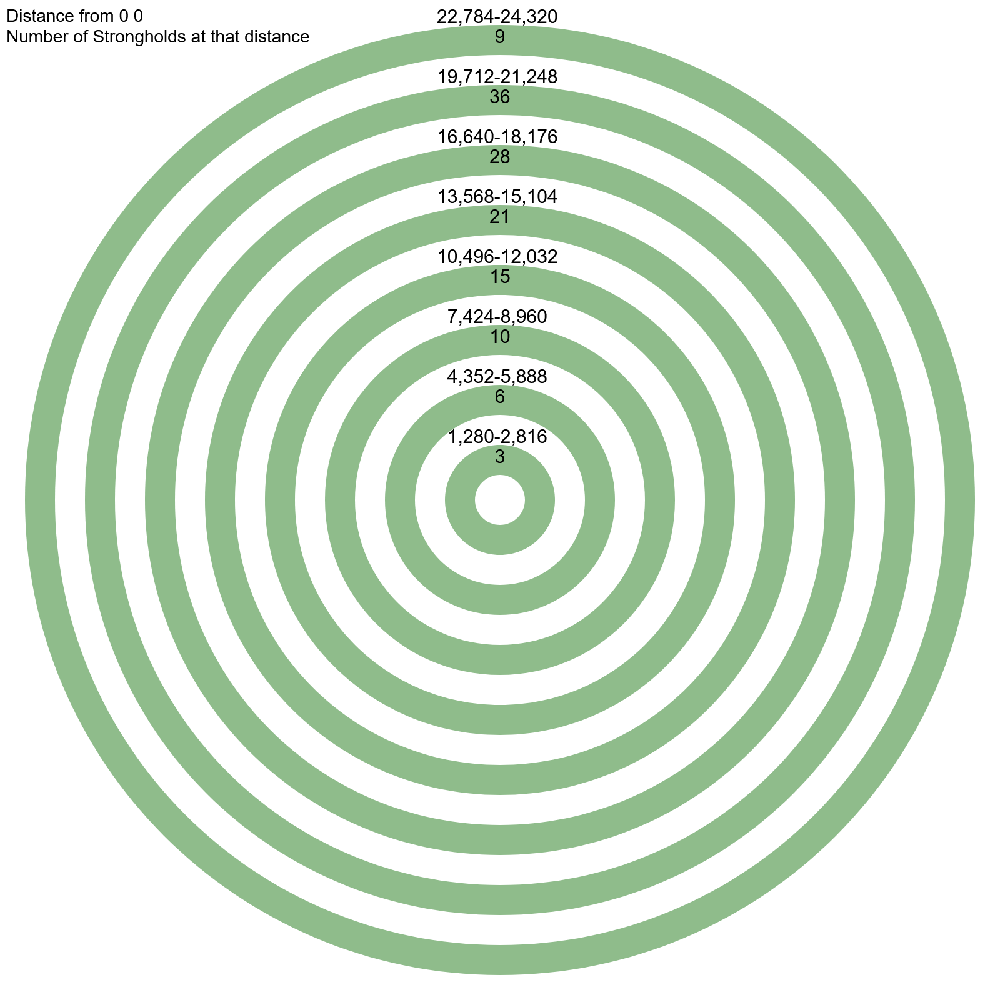

Secondly, each stronghold must start generating at the 8, 8 coordinate in a chunk (a chunk is 16x16 blocks large). With this, we can create a large but manageable list of every possible coordinate a stronghold can point to. A bit like this.
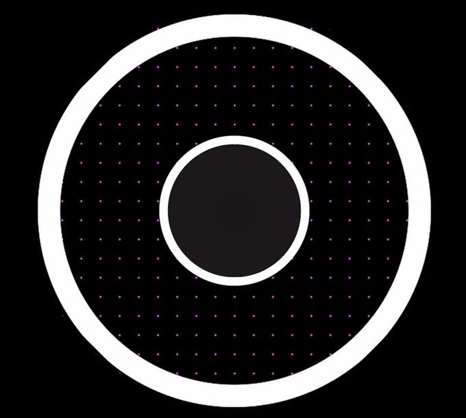

Now we have this large set; we can measure the angle the eye is pointing, as well as where the player is standing. With this info, we can calculate: what are the chances these coordinates were the actual ones the eye of ender was pointing to? This diagram below shows a cone/triangleish shape, which is a range of possible angles your eye of ender could be pointing to. 
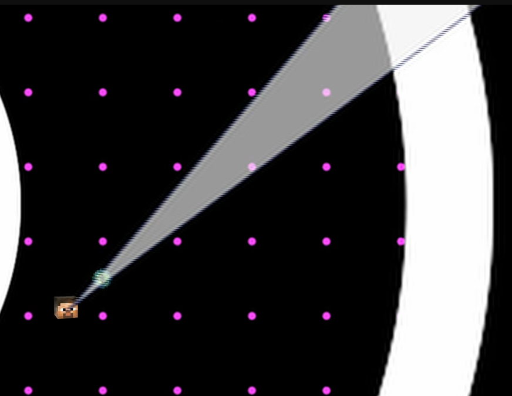

Now why are we forming this shape? Well, that is because of the main issue which the previous method did not address. Inaccuracy in measurements. We can resolve this by normally distributing the measured angle, with a standard deviation being the angle in degrees that the player's measurements vary by. What this essentially means is that we are deciding how much to trust the player's measurement.

Then we have the final part where we compare each candidate with a reasonable chance of being selected against each other and see what the chance is that this one is actually the one the eye meant to point at.  

Then we can combine all this to create a list of probable candidates where the stronghold could be. 

### The Math behind it 

The paper starts off by algebraically defining the locations of a stronghold within a ring (let's call this ring k).  
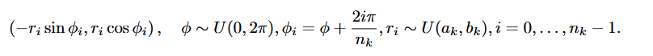

We are first randomly generating an angle between 0 and 2π (aka 0 and 360 degrees, but for ease we will be using radians for the rest of the explanation).  
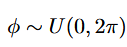

Then we are equally distributing this across the entire ring; let's say the ring had 3 strongholds, n_k would be 3 and the variable "i" would increment from 0 to 2. This results in the strongholds being equal angles apart  
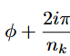

This randomly decides how far away from (0, 0) the strongholds should be placed using a uniform distribution (all numbers have equal chance). a_k and b_k are the start and end displacements of the ring regions.  
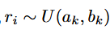

Afterwards, the stronghold does 2 different snaps. One to the 8,8 coordinate of the chunk. Another will be a biome snap where it tries to search for a valid place to place the stronghold anywhere between 0 and 128√2 blocks in any direction.  
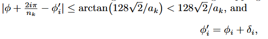

Now that we know how the strongholds are placed, I want to jump a bit ahead to how the measurement error is accounted for because it makes a lot more sense chronologically. The measurement error essentially deciding how accurate your measurement is and how much it should be trusted.

That's why we add in some extra math to account for the errors we get with both Minecraft and human imprecision.

This first line here basically means we are going to create a massive set with every possible coordinate the eye could be pointing to. This is possible because there are a pretty finite number of places where one can spawn. Only (8, 8) coordinates in a chunk, which is in one of the ring regions. 
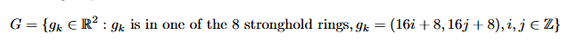  

When we read the player's measurement of the eye of ender angle, we assume it is [normally distributed](https://en.wikipedia.org/wiki/Normal_distribution) with the standard deviation being a value they themselves select. The standard deviation should be how much the player's measurements vary by when they measure the eye. The mean for the distribution is 0 (a perfect measurement). This is because a player's measurements should vary equal amounts to the left and right. The normal distribution is calculated as a [PDF](https://en.wikipedia.org/wiki/Probability_density_function). We add this to the theoretically perfect angle between you and the stronghold. This math is then repeated for every throw as well as for each chunk in the set G. Then we apply [Bayes' Theorem](https://en.wikipedia.org/wiki/Bayes%27_theorem) to update our probabilities as more eyes are thrown.   
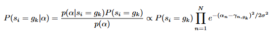

Now we can go back to finding the closest stronghold. This is mostly where all the scary parts come into play. I won't go into exact detail with this as I am yet to fully understand it myself but the general idea here is we are each comparing each candidate chunk (i in this case) to each other one (l) and trying to find what are the chances there is a closer stronghold. R1 and R0 are the bounds where if a l spawns inside it is closer to you than i.   
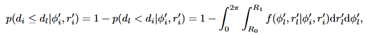  

This is some math saying what is the chance of the zone we calculated earlier intersecting with a ring reigon which is not the same one as the out current one.  
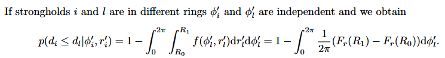

"But sTuUnNNtTt what if they are in the same ring????" 

Umm, we take them out back and pretend they never existed cause that is too complicated with literally no payoff. Fun fact. We do not NEED to be insanely precise for this integral, we can approximate them and take quite a few shortcuts here and achieve good enough results.  
One such approxiation is utilising Simpson's rule for approximating integrals. Another one is not calculating for the entire set instead only doing so for relevant reigons. These bring our times to calulate from heat death of the universe down to about 2 ish seconds. 

There are other aspects of this paper that I have also chosen to not consider due to them overcomplicating the math with not a siginificant enough return. One example of this is the Beta disribution.
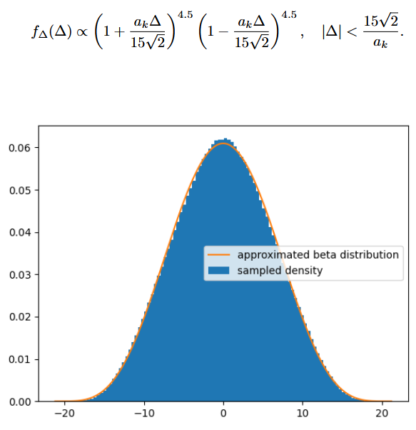

This is only accounted for when we are trying to find a closer stronghold in the same place as the candidate stronghold. However, this is quite unlikely due to the way strongholds spawn with the angling so we opt to pretend that this won't happen as it compicates the code and increases runtime. Both of which I cannot afford atp tbh.

---

## Seed Finder

## Usage Guide 

If you want a video tutorial on how to use it, check out the same tutorial video as before. There will be a video demonstration of how to use that part there. If you want a text walkthrough. Keep reading onwards. 

1. Open the program and click on seed finder. 
2. Select the seed type which you want to search for and click Submit.
3. Wait a while for the program to find a valid seed. 
4. Once a valid seed has been found:
   1. Open Minecraft 1.16.1
   2. Select "Create New World"
   3. Select "More world options"
   4. In the text box, paste in the generated seed
   5. Select "Create New World"

## Important Notes and Tips 
 - The filters for Ruined Portal and Shipwreck are quite slow. So if you just want to test the seed filter, do not filter for these filter for Desert Temple or Buried Treasure, as these filter quickly.
 - All found structures will spawn in the positive, positive quadrant of the world. (For example, if your coordinates are (20, 70, 10) then that would be the positive, positive quadrant whilst (-20, 70, 10) would be the negative positive quadrant.)
 - For ruined portals, they are NOT guaranteed to spawn above ground. So if you filter for one and do not see it then it likely spawned underground. There was no way for me to try to filter these out, unfortunately.
 - The seed filter does not guarantee a way to enter the Nether quickly, such as obsidian or a lava pool. 
 - A bastion is guaranteed within 8 chunks of spawn. It will also always be in the positive, positive quadrant.

## Seed Filter Conditions 

Below are the requirements for each seed type to be allowed.

---
**WARNING**

All intended structures will generate in the Positive, Positive quadrant. Furthermore, my seed filters do NOT guarantee a nether enter OR a Nether Fortress wihin a reasonable distance as of right now. Food is also not guaranteed.

---

#### Village 

 - At most 7 Chunks from spawn
 - Contains 1 or more blacksmiths
 - One of the chests in the village contains at least 4 iron or 1 iron and 3 diamonds. (You kill the golem for the other 3 iron needed) 

#### Desert Temple 

 - At most 5 Chunks from spawn
 - Contains at least 7 iron or 4 iron and 3 diamonds.

#### Buried Treasure 

 - At most 5 Chunks from spawn
 - Contains at least 7 iron or 4 iron and 3 diamonds.

#### Shipwreck 

 - At most 6 Chunks from spawn
 - Contains at least 7 iron or 4 iron and 3 diamonds.

#### Ruined Portal 

 - At most 6 Chunks from spawn
 - Guarantees 1 Fire Charge and 27 Iron Nuggets

#### Bastion 

 - At most 12 chunks from 0, 0
 - Can be any bastion type
